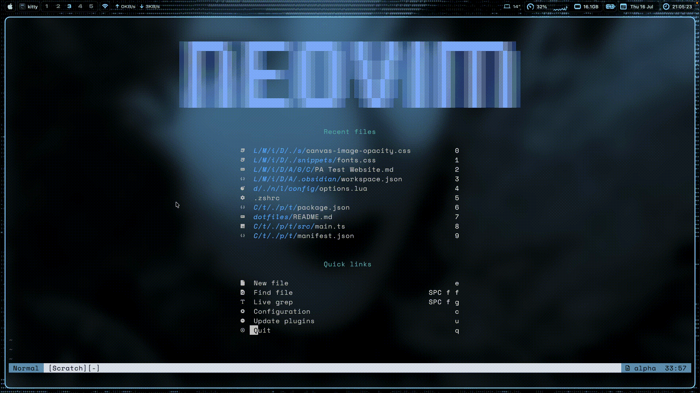

# dotfiles

This is my main dotfiles configuration.
It is not stable by any means. Use at your own risk.

Built on macOS Tahoe 26.3

## Tools Used

| Title | Purpose |
| ----- | ------- |
| [fastfetch](https://github.com/fastfetch-cli/fastfetch) | System Specs Fetch |
| [GNU Stow](https://www.gnu.org/software/stow/) | Easy symlinking |
| [JankyBorders](https://github.com/FelixKratz/JankyBorders) | Window Borders |
| [Kickstart.nvim](https://github.com/nvim-lua/kickstart.nvim) | Nvim config starting point |
| [Kitty](https://github.com/kovidgoyal/kitty) | Terminal Emulator |
| [Nvim](https://github.com/neovim/neovim) | Editor |
| [Opencode](https://github.com/anomalyco/opencode) | Agentic AI |
| [skhd](https://github.com/asmvik/skhd) | Hotkey daemon |
| [SketchyBar](https://github.com/FelixKratz/SketchyBar) | Custom menu bar |
| [sketchybar-system-stats](https://github.com/joncrangle/sketchybar-system-stats) | Event provider for SketchyBar |
| [Starship](https://github.com/starship/starship) | Custom prompt |
| [Superfile](https://github.com/yorukot/superfile) | TUI File Explorer |
| [Tmux](https://github.com/tmux/tmux) | Terminal Mutliplexer |
| [yabai](https://github.com/asmvik/yabai) | Tiling WM |

---

### Neovim

This neovim configuration contains everything that can be
found in kickstart.nvim, with the addition of the following:

| Title | Purpose |
| ----- | ------- |
| [alpha](https://github.com/goolord/alpha-nvim) | Dashboard |
| [dadbod](https://github.com/tpope/vim-dadbod) | DB work |
| [opencode](https://github.com/nickjvandyke/opencode.nvim) | Opencode Integration |
| [snacks](https://github.com/folke/snacks.nvim) | Collection of QoL tools |
| [dooing](https://github.com/atiladefreitas/dooing) | To Do list |
| [typescript-tools](https://github.com/pmizio/typescript-tools.nvim) | Typescript all-in-one plugin |
| [neo-tree](https://github.com/nvim-neo-tree/neo-tree.nvim) | File explorer |

---

### SketchyBar

Sketchybar uses SbarLua in this setup.
Sketchybar stats provider is used to provide event subscription to system processes.
If you are using an intel mac this will likely not work straight away
as you install these dotfiles and you might have to change the path
to the stats provider in the `sketchybarrc`.

[sketchybar-system-stats](https://github.com/joncrangle/sketchybar-system-stats)
is being used as an easy way to
provide system events to sketchybar.
This can be used to create cpu graphs etc.

- Edit .config/sketchybar/colors.lua for different colours

### JankyBorders

- Bootstrapped process with Yabai (see /config/yabai/yabairc)
Provides coloured borders around windows.

### Yabai

- SIP (System Integrity Protection) **doesn't** need to be disabled
for this yabai config to work.
- Shortcuts managed in .config/skhd/skhdrc
- App exceptions, mouse bindings & default settings managed in .config/yabai/yabairc
- Instant space switching is achieved via [this tool](https://github.com/jurplel/InstantSpaceSwitcher)

### skhd

skhd with [hyperkey](https://hyperkey.app) is used to add shortcuts for managing
applications

---

## Acknowledgements

Sketchybar config inspired by FelixKratz's [dotfiles](https://github.com/FelixKratz/dotfiles)

[Kickstart.nvim](https://github.com/nvim-lua/kickstart.nvim)
is a great way to get into neovim, and was a starting point
for this neovim config.  

If you're after making your first config I'd recommend using kickstart and not
using a pre-made configuration like this one.

I would like to sincerely thank all developers that built the tools I use
day-to-day!
